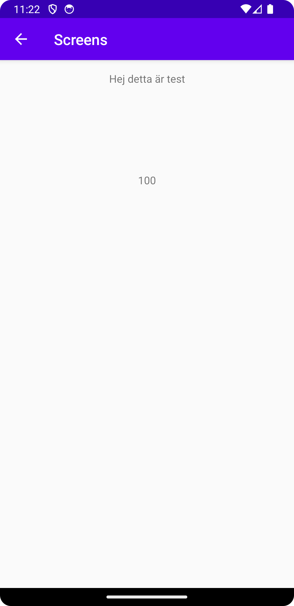

# Rapport

Added a second activity as an empty views activity by right clicking the files in the left bar and choosing new. Then a button identified by 
"buttonToStartSecondActivity" was programmed in the main activity to start the second activity. When the button is clicked it triggers the
listener attached to it and an intent is created that handles a transition from MainActivity to SecondAcitivty. Then two pieces of extra data is added to the intent bundle
"MessageTest" which is a string and "number" which is an integer, that pass data from the MainActivity to the SecondActivity. Two widgets as textviews have been added
to the Second Activity named TextView & TextView 2. 

The following snippet of code shows how the program retrieves the intent extras. First it retrieves a bundle of extras from the intent that started the activity.
If the extras is not equal to null it proceeds to retrieving a string and an integer from the bundle using specific keys. The two different textviews are then identified
by their assigned ID's and will then print out "Hej detta är test" and the number "100", since this is what is assigned to them when retrieved, in the mainactivity.
There is also an attached screenshot that shows the displayed outcome when pressing the "buttonToStartSecondActivity".

// Retrieving the intent extras
Bundle extras = getIntent().getExtras();
if (extras != null) {
String name = extras.getString("MessageTest");
int number = extras.getInt("number");
TextView textView = findViewById(R.id.textView);
TextView textView2 = findViewById(R.id.textView2);
textView.setText(name);
textView2.setText("" + number);

## Följande grundsyn gäller dugga-svar:

- Ett kortfattat svar är att föredra. Svar som är längre än en sida text (skärmdumpar och programkod exkluderat) är onödigt långt.
- Svaret skall ha minst en snutt programkod.
- Svaret skall inkludera en kort övergripande förklarande text som redogör för vad respektive snutt programkod gör eller som svarar på annan teorifråga.
- Svaret skall ha minst en skärmdump. Skärmdumpar skall illustrera exekvering av relevant programkod. Eventuell text i skärmdumpar måste vara läsbar.
- I de fall detta efterfrågas, dela upp delar av ditt svar i för- och nackdelar. Dina för- respektive nackdelar skall vara i form av punktlistor med kortare stycken (3-4 meningar).

Programkod ska se ut som exemplet nedan. Koden måste vara korrekt indenterad då den blir lättare att läsa vilket gör det lättare att hitta syntaktiska fel.

/*Fork the app screens and clone the fork from your own Github repository in Android Studio
Your forked GitHub project must have at least three meaningfull commits of code with descriptive comments. Remember to keep your commits brief and your commit messages informative. A reader of the commit history should be able to determine what change is included in a particular commit. We require at least 3 commits of program code that are meaningful.
Add a second activity
Add a button in the first activity that starts the second activity
Add data to the intent bundle using extras
In the layout of in the second activity add least one widget to show data from the intent
Write a short report where you explain the things that you have done
Upload all artifacts as described in the assignment requirements.<

Bilder läggs i samma mapp som markdown-filen.

Läs gärna:

- Boulos, M.N.K., Warren, J., Gong, J. & Yue, P. (2010) Web GIS in practice VIII: HTML5 and the canvas element for interactive online mapping. International journal of health geographics 9, 14. Shin, Y. &
- Wunsche, B.C. (2013) A smartphone-based golf simulation exercise game for supporting arthritis patients. 2013 28th International Conference of Image and Vision Computing New Zealand (IVCNZ), IEEE, pp. 459–464.
- Wohlin, C., Runeson, P., Höst, M., Ohlsson, M.C., Regnell, B., Wesslén, A. (2012) Experimentation in Software Engineering, Berlin, Heidelberg: Springer Berlin Heidelberg.
